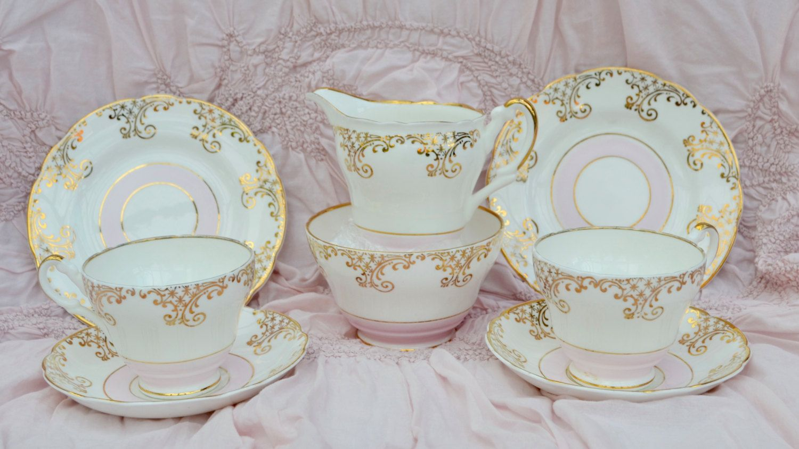

```{r knitr_init, echo=FALSE, cache=FALSE}
library(knitr)
library(rmdformats)

## Global options
options(max.print="75")
opts_chunk$set(echo=TRUE,
	             cache=TRUE,
               prompt=FALSE,
               tidy=TRUE,
               comment=NA,
               message=FALSE,
               warning=FALSE)
opts_knit$set(width=75)
```

# Introduction {.tabset .tabset-fade .tabset-pills}

## Motivation

E-commerce and online business transaction are growing every year. According to  <a href = https://www.bigcommerce.com/blog/amazon-statistics/#10-fascinating-amazon-statistics-sellers-need-to-know-in-2019> bigcommerce </a>, there are over 5 billion items shipped worldwide in 2017, with more than 12 million varieties of products sold from Amazon alone. Many retailers are now focused to sell their products online, as can be seen that more than 50% of all sales come from third-party sellers, who also sell their products on other platform outside of Amazon. Soon, more people will buy things online instead of going to the conventional mortar and bricks store.

Great online shopping experience can further boost the sales. One of the most promising features to enhance the shopping experience is by applying recommender system, where the website or application give recommendation on what people may buy based on their current shopping list or past purchases. Another interesting way to attract customer is by creating a themed category, where  promoted collection of items have high likelihood to be bought together, such as kitchen set or christmas decoration set. One way to implement them is by using a data mining method called **Association Rules**. Here we will learn how to apply association rules in online retail transactions and visualize them using network graph.

## Objectives

* Understand Association Rules
* Understand Network Analysis
* Propose Business Plan for Online Retail Sales

## Library and Setup

```{r message=FALSE}
library(tidyverse)
library(networkD3)
library(arules)
library(arulesViz)
library(igraph)
library(visNetwork)
library(openxlsx)

options(scipen = 999)
```

# Association Rule

## Concepts

Association rule is a method to find rules that define association or coocurrence between two or more items/objects. For example, people who bought bread are likley to buy milk as well, or a father who just had a baby may by diapers alongside their own beverage, such as beers. In convenience stores, association rules can give advantage to the store manager, as they can manage or adjust the product placement that will optimize their sales, since they knew what products should be placed adjacently so the likelihood that people will buy a combination of products will increase. In online store or any website in general, association rules can be used as a base for recommender system, such as what movies you are likely to watch if you currently watch Star Wars, or recommending songs on spotify.

In order to measure the power of each rules and assess which rules are worthy enough to be considered, there are 3 metrics that we can use: support, confidence, and lift.

### Support 

Support represent the ratio between the number of transaction which contain both item **a** and **b** with the number of all transactions. The higher the support, the combination of two or more items would appear more frequent in the dataset. 

$$ Support \ Rule(a =>b) = \frac{Number \ of \ transaction \ containing \ a \ and \ b} {Number \ of \ all \ transaction}$$

### Confidence

Confidence represent the probability of combination item **a** and **b** would appear together if we know that the customer buy item **a**. 

$$ Confidence \ Rule(a =>b) = \frac{Number \ of \ transaction \ containing \ a \ and \ b} {Number \ of \ transaction \ containing \ a}$$

### Lift

Lift represent how much the present of item **a** increase the confidence that people will buy item **b**.

$$ Lift \ Rule(a =>b) = \frac{Confidence \ Rule(a => b)} {Support (b)} $$

Where 

$$ Support(b) = \frac {Number \ of \ transaction \ containing \ b} {Number \ of \ all \ transaction}$$

## Association Rule with `arules` package

### Import Data

Here is the original data I acquired through Kaggle (https://www.kaggle.com/jihyeseo/online-retail-data-set-from-uci-ml-repo). I will transform the data into format that fits for association rules.

The data is transactions record occurring between 01/12/2010 and 09/12/2011 for a UK-based and registered non-store online retail. The company mainly sells unique all-occasion gifts. 

```{r}
retail <- read.xlsx("data_input/online retail.xlsx") 
colnames(retail) <- tolower(colnames(retail))
retail
```

We preprocessed the data

```{r }
df <- retail %>% 
  select(invoiceno, description) %>% 
  mutate(description = str_trim(description, side = "both")) %>% 
  mutate(invoiceno = factor(invoiceno),
         description = str_replace_all(description, "[']", replacement = "")) %>% 
  mutate(description = tolower(str_replace_all(description,pattern = "[ ]", replacement = "_")))

head(df)
```

The function below are used to transform the data into market basket format (transactions). This process may take a while. If you want to get the result directly, here is <a href = https://drive.google.com/file/d/1BjcWz8a1Ez1H8YA2RX9LhF52WpMlQBCn/view?usp=sharing> the link </a>.

```{r eval=FALSE}
prep_data <- function(x){
  y <- data.frame()
  for (i in 1:n_distinct(df$invoiceno)) {
    x <- df %>% 
      filter(invoiceno == levels(invoiceno)[i]) %>%
      t() %>% 
      as.data.frame() %>% 
      slice(2) %>% 
      mutate(invoiceno = levels(df$invoiceno)[i]) %>% 
      select(invoiceno, everything())
    colnames(x) <- c("invoiceno", paste0("item_", 1:(ncol(x)-1)))
  print(i)
  y <- list(y,x) %>% rbindlist(fill = T)
}
return(y)
}

df_prep <- prep_data()
```

```{r echo=FALSE}
df_prep <- read.csv("data_input/transaction retail.csv")
```

```{r}
df_prep
```

We can directly transform the data into transactions using `as(df_prep, Class = "transactions")`. Here we inspect at the first 4 transactions by using `LIST()` function. Each list is a single transaction. However, if we use this method, the names of the column is pasted with the item name. This will affect the model since we also look at the order of the item in the basket. It would be better if we remove the column name and simply retrieve the item name.

```{r}
transaction <- as(df_prep, Class = "transactions")
LIST(head(transaction, 4))
```

So instead we will save the data into `.csv` format and use `read.transasctions()` function from `arules` packages to read data as transaction object. 

```{r eval=FALSE}
write.csv(df_prep %>% select(-invoiceno), "data_input/transaction retail.csv", row.names = F)
```

```{r}
trans_retail <- read.transactions("data_input/transaction retail.csv", sep = ",", header = T)

LIST(head(trans_retail, 4))
```

The data consists of about 25,900 number of transactions. The first transaction have 7 items purchased, while the second transaction only consists of 2 items. Now let's start create association rules to see what products are good to sell together or recommended.

### Create Rules

Let's create association rule. We limit the created rule only limited to `support` minimal 0.01 and `confidence` minimal 0.7.

```{r}
rules <- apriori (trans_retail, parameter = list(supp = 0.01, conf = 0.7))
```

### Explore the Rules

Let's look at the rules that has the highest `confidence`.

```{r}
rules_conf <- sort (rules, by="confidence", decreasing=TRUE) 

inspect(head(rules_conf))
```

A lot of the rules consists of 3 items for the precedent and has high confidence (more than 0.85). For example, according to the first rule, if the people buy `pink regency teacup and saucer`, `regency cakestand 3 tier`, and `roses regency teacup and saucer`, it is likely that people will also buy `green regency teacup and saucer`. There are 303 transactions that have these combination of items, which if we divide them by the total number of transaction record (25900), we get the `support` value of 0.01169884. The `confidence` that the appearance of the first 3 items will lead to high likelihood that people will also buy `green regency teacup and saucer`. The `lift` value from the rule is more than 1 and quite high, suggesting that the presence of the first 3 items have a big impact toward the increase of the `confidence` value. According to the second rule, if people buy `regency tea plate pink`, people will also buy `regency tea plate green`. The second rule has bigger `lift` compared to the first rule.

Let's look at the rules that has the highest `lift`.

```{r}
rules_lift <- sort (rules, by="lift", decreasing=TRUE) 

inspect(head(rules_lift, 10))
```

Rules that has `lift` means that the presence of items purchased such as the `regency tea plate pink` can actually lead to increase in confidence that people will buy `regency tea plate green`. How can we benefit from this rules? Since this is online retail transactions, we can consider to set the rules as a recommender system, like showing the `regency tea plate roses` on the bottom of the screen when people putting `regency tea plate pink` on their cart. We may make a bundle package or collector edition for `regency tea plate` varieties to increase sales since the majority of the top 10 rules are associated with `regency tea plate` items.



Analyzing the rules in form of text or tabular may not be the best way and can be troublesome. If we have a lot of rules, it's hard too see the relationship between rules or items that correspond them. Some rules may create a network or chain with other rules. This insight can only be seen if we visualize the rules in meaningful way. Therefore, we will do network analysis for the association rules.

# Network Analysis

## Concepts

A network/graphs is a method to visualize relationship between discrete objects. There are several types of network analysis: electrical network analysis, social network analysis, biological network analysis, link analysis, etc. Generally, a network is consists of two parts: nodes and edges. 

* Nodes

A nodes is a single point or circle that represent a discrete component or object. The size or color of the nodes may represent any numerical value to signify the importance of the nodes, such as how big is the frequency of item a in the dataset.

* Edges

An edges is a line that represent the relationship between two nodes/objects. If the relationship has directions, such as causal effect (item a increase the probability of sales of item b or the present of item a increase the likelihood of the presence of item b), the line become an arrow.

There are many ways to draw graph/network in R. Here, we will illustrate how to draw network for association rules with 2 kind of packages: `ArulesViz`, `visNetwork`. I also put extra material with `networkD3` package if you want to explore more.

## Create Network with `ArulesViz`

Let's create network for 50 rules that has the highest `lift`

```{r fig.width=12}
subrules <- head(rules, n = 50, by = "lift")
inspect(head(subrules))
```

Drawing a network using the `ArulesViz` package is straightforward. We simply need to use `plot()` function. The default plot is drawn using `igraph` package.

```{r fig.width=12}
plot(subrules, method = "graph", measure = "lift", shading = "confidence")
```

We can make more interactive plot by changing the `engine` parameter into `htmlwidget`

```{r fig.width=12}
plot(subrules, method = "graph", measure = "lift", shading = "confidence", engine = "htmlwidget")
```

The circle represent each rules, with arrow heading toward them is the antecedent/precedent and the arrow our from them represent the consequence. For example, in `Rule 1` we can see that the antecedent is `regency tea plate pink` while the consequence is `regency tea plate green`, meaning that in `Rule 1`, people who buy `regency tea plate pink` are likely to buy `regency tea plate green` as well. The detailed information can be seen from the tooltip when we hover on the nodes or text.

Using `ArulesViz` is an easy way if we want to quickly create graph/network. However, they are hard to customize. Next, we will try to customize and build the network from scratch with `visNetwok`.

## Create Network with `visNetwork`

Before we create new network, first we must retrieve the rules information first. We can use `DATAFRAME()` function to retrieve the rules in form of data frame. 

```{r}
df_rules <- DATAFRAME(subrules) %>% 
  rowid_to_column("rules") %>% 
  mutate(rules = paste("Rules", rules),
         RHS = str_remove_all(string = RHS, pattern = "[{}]"))

df_rules
```

Let's tidy the data to separate the `LHS` into several columns, since some rules have more than 1 items embedded.

```{r}
df_items <- df_rules %>% 
  mutate(LHS = str_remove_all(string = LHS, pattern = "[{}]")) %>% 
  separate(col = LHS, into = c(paste0("item_", 1:3)), sep = ",") %>% 
  pivot_longer(cols = c(item_1, item_2, item_3), names_to = "antecedent", values_to = "item") %>% 
  select(rules, antecedent, item, RHS, everything()) %>% 
  filter(is.na(item) == F)

df_items
```

Let' create the nodes. We will directly link the items without showing the rules

```{r}
nodes <- data.frame(name = unique(c(df_items$item, df_items$RHS, df_items$rules))) %>% 
  rowid_to_column("id") %>% 
  mutate(group = ifelse(str_detect(name, "Rules"), "A", "B"),
         label  = name,
         value = c(rep(NA, n_distinct(c(df_items$item, df_items$RHS))), df_rules$lift),
         support = c(rep(NA, n_distinct(c(df_items$item, df_items$RHS))), df_rules$support),
         confidence = c(rep(NA, n_distinct(c(df_items$item, df_items$RHS))), df_rules$confidence),
         shape = ifelse(group == "A", "circle", "box"),
         color = ifelse(group == "A", "lightblue", "lightgreen"),
         title = ifelse(test = group == "A",
                        yes = paste(name,
                                    "<br> Lift:", round(value, 2),
                                    "<br> Confidence:", round(confidence, 2),
                                    "<br> Support:", round(support, 2)),
                        no = as.character(name))
  )


nodes
```

Let's create the edges and remove redundant direction. 

```{r}
edges <- data.frame(from = df_items$item,
                    to = df_items$rules) %>% 
  bind_rows(data.frame(from = df_rules$rules,
                       to = df_rules$RHS)) %>% 
  left_join(nodes, by = c("from" = "name")) %>% 
  select(id, to) %>% 
  rename(from = id) %>% 
  left_join(nodes, by = c("to" = "name")) %>% 
  select(from, id) %>% 
  rename(to = id) %>% 
  mutate(color = ifelse(to <= 33, "red", "lightgreen"))

edges
```

We have prepared the nodes and the edges for our network. Next, we use `visNetwork()` function to build the network.

```{r }
visNetwork(
  nodes = nodes,
  edges = edges,
  height = "500px", 
  width = "100%") %>%
  visEdges(arrows = "to") %>%
  visOptions(highlightNearest = T) %>% 
  visInteraction(
    tooltipStyle = 'position: fixed; visibility: hidden; padding: 5px; white-space: nowrap;
    font-size: 18px; color: black; background-color: white; border-color: orange'
    ) 
```

## Analyze the Network

Let's get some insights from the network we've extracted from the 50 rules with highest lift.

* There are at several rules that don't form network, such as rules 14 {small marshmallows pink bowl => small dolly mix design orange bowl} and rules 17 {toilet metal sign => bathroom metal sign}.
* Some products from regency tea set product form a network consists of at leats 12 interconnected rules. The item `regency cakestand 3 tier` become the antecedent of many rules, while the item `roses regency teacup and saucer` and `green regency teacup and saucer` become antecedent as well as consequence of many rules. The network only consists of 4 items purchased, suggesting that items are influencing each other probability to be bought. The key is item `regency cakestand 3 tier`, since it doesn't become a consequence. If we can make people buy this product, chances are people will also buy the rest of them. We may want to create a special package consists of those 4 items, since people are likely to buy all of them together.
* Another big network is some product related to charlotte bag, consists of 17 rules. `charlotte bag pink polkadot` and `strawberry charlotte bag` become for many rules, while item `red retrospot charlotte bag` become consequence of many rules as well as an antecedent. The product mostly consists of bag, so we may want to create a collector edition or give discount or any other promo if people already has one of them.

# Conclusion

Association rules can be used to help store manager or online merchant to increase their sales. Understanding the association or co-occurence between items will help us plan what promo or recommendation we will give to people based on their purchases. Network analysis help further help us find more insight compared to if only we look at the rules individually.

# Extra

## Create Network with `networkD3`

`networkD3` is another package that you can use to visualize your data into network. Personally, I think the graph visualized is more beautiful than `visNetwork`.

### Create Edges and Nodes for d3

We will use the same `notes` and `edges` from the previous process.

```{r}
nodes_d3 <- mutate(nodes, id = id - 1) 

edges_d3 <- mutate(edges, from = from - 1, to = to - 1) %>% 
  mutate(value = 1)
```

### Create Network

Use `forceNetwork()` function to build the network

```{r}
forceNetwork(Links = edges_d3, Nodes = nodes_d3, Source = "from", Target = "to", 
             NodeID = "label", Group = "group", Value = "value", 
             arrows = T, Nodesize = "value",
             colourScale = JS("d3.scaleOrdinal(d3.schemeCategory10);"),
             linkColour = edges_d3$color,
             opacity = 0.8, fontSize = 24, 
             zoom = TRUE)
```

#### Sankey Diagram

Alternatively, we can visualize the flow or direction from the antecedent to the consequence using Sankey Diagram.

```{r}
sankeyNetwork(Links = edges_d3, Nodes = nodes_d3, Source = "from", Target = "to", 
              NodeID = "label", Value = "value")
```

